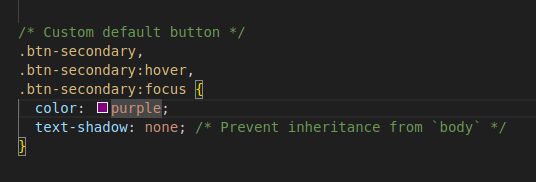
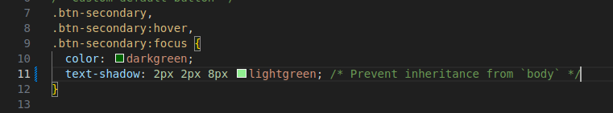

<div align=justify>
<center>

# Documentación y sistema de control de versiones


</center>

***Nombre:*** Nabil León Álvarez [(@nalleon)](https://github.com/nalleon) y Pedro Martín Escuela [(@petermartesc)](https://github.com/petermartesc)
<br>
***Curso:*** 2º de Ciclo Superior de Desarrollo de Aplicaciones Web.
___

### ÍNDICE

+ [Introducción](#id1)
+ [Objetivos](#id2)
+ [Material empleado](#id3)
+ [Desarrollo](#id4)
+ [Conclusiones](#id5)


#### ***Introducción***. <a name="id1"></a>


En esta práctica trabajaremos tanto la realización de documentación por medio de informes en markdown así como el control de versiones utilizando Git y GitHub para tanto, la creación y manejo de repositorios, como para la de ramas, issues, forks y pull request. Además de la colaboración al tener que trabajar en equipo. 


#### ***Objetivos***. <a name="id2"></a>


Como objetivo, esta práctica tiene el de reforzar nuestros conocimientos sobre el uso de herramientas de control de versiones y documentación, ya que son esenciales en nuestro sector, adquiriendo además mayor agilidad en la realización de estas.


#### ***Material empleado***. <a name="id3"></a>

Enumeramos el material empleado tanto hardware como software y las conficuraciones que hacemos (configuraciones de red por ejemplo) 

Hemos utilizado los siguientes materiales para llevar a cabo esta práctica:

1. PC
2. Navegador Web para poder acceder y trabajar con GitHub.
3. Terminal para la ejecución de comandos.
4. VisualStudio Code para la realización del informe en markdown.

#### ***Desarrollo***. <a name="id4"></a>

Durante la práctica Pedro será el user1 y Nabil el user2.

<br>

En primer lugar, Pedro creará un [repositorio](https://github.com/PeterMartEsc/git-work) público cuyo nombre será git-work. Este tendrá únicamente un README.md y la licencia MIT.

<div align="center">
    
</div>

<br>

Seguidamente, clonará el repositorio con el siguiente comando:

```bash
git clone https://github.com/PeterMartEsc/git-work
```

Tras esto, añadirá los ficheros index.html, bootstrap.min.css y cover.css que se han proporcionado para la actividad y subirá sus cambios.

<div align="center">
    
</div>

<br>

Seguidamente, Nabil creará un [fork](https://github.com/nalleon/git-work) del repositorio git-work desde GitHub.

<div align="center">
    
</div>

<br>

Una vez creado, se ha clonado su fork haciendo uso del comando:

```bash
git clone git@github.com:nalleon/git-work.git
```

<div align="center">
    
</div>

<br>

Pedro a su vez ha creado una issue cuyo título es `Add custom text for startup contents`.

<div align="center">
    
</div>

<br>

Una vez realizado el punto anterior, Nabil creará una rama llamada `custom-text` y modificando el fichero index.html.

El comando utilizado será el siguiente:

```bash
git checkout -b custom-text
```

<div align="center">
    
</div>

<br>

En cuanto a la modificacion del fichero, simplemente se añadirá el siguiente contenido:

```html
<div class="cover-container d-flex w-100 h-100 p-3 mx-auto flex-column">
    <header class="mb-auto">
        <div>
        <h3 class="float-md-start mb-0">IES PUERTO DE LA CRUZ</h3>
        <nav class="nav nav-masthead justify-content-center float-md-end">
            <a class="nav-link active" aria-current="page" href="#">Home</a>
            <a class="nav-link" href="#">Features</a>
            <a class="nav-link" href="#">Contact</a>
        </nav>
        </div>
    </header>

    <main class="px-3">
        <h1>DPL.</h1>
        <p class="lead">Despliegue de Aplicaciones Web.</p>
        <p class="lead">
        <a href="#" class="btn btn-lg btn-secondary fw-bold border-white bg-white">2ºDAW</a>
        </p>
    </main>
</div>
```
<br>

<div align="center">
    
    
                                              
</div>

<br>


Una vez realizado el paso anterior, Nabil se dirigirá a su fork de GitHub para enviar una Pull Request (PR) a Pedro.

<div align="center">
    
    
</div>


Para hacer las comprobaciones en local, Pedro creará una nueva rama llamada `revisar-custom-text` la cual estará basada en la rama custom-text del fork, la cual, además se encontrará apuntando en el upstream del repositorio.

Para ello se harán uso de los siguientes comandos:

```bash
git remote add upstream http://github.com/nalleon/git-work
git fetch upstream
git checkout -b revisar-custom-text upstream/custom-text
```

<div align="center">
    
</div>

<br>

Una vez realizado el punto anterior, se editará el index.html con otros cambios:

```html
<main class="px-3">
    <h1>DPL.</h1>
    <p class="lead">Desarrollo en Entorno de Servidor</p>
    <p class="lead">
    <a href="#" class="btn btn-lg btn-secondary fw-bold border-white bg-white">2ºDAW</a>
    </p>
</main>
```

> Se ha cambiado el texto de Despliegue de aplicaciones Web a Desarrollo en Entorno de Servidor


<div align="center">
    
</div>

<br>

Seguidamente, tenido una conversación en la página del PR en la que hemos llegado a la conclusión de realizar dos cambios más.

<div align="center">
    
</div>

<br>

Pedro ha corregido el texto para que vuelva a poner Despliegue de Aplicaciones Web.

<div align="center">
    
</div>

<br>

```html
<main class="px-3">
    <h1>DPL.</h1>
    <p class="lead">Despliegue de Aplicaciones Web</p>
    <p class="lead">(2025-2026)</p>

    <p class="lead">
    <a href="#" class="btn btn-lg btn-secondary fw-bold border-white bg-white">2ºDAW</a>
    </p>
</main>
```

<br>

En cambio, Nabil ha añadido un nuevo parrafo con los años del curso.

<div align="center">
    
</div>


```html
<main class="px-3">
    <h1>DPL.</h1>
    <p class="lead">Despliegue de Aplicaciones Web</p>
    <p class="lead">(2025-2026)</p>

    <p class="lead">
    <a href="#" class="btn btn-lg btn-secondary fw-bold border-white bg-white">2ºDAW</a>
    </p>
</main>
```

<div align="center">
    
</div>

<br>

Tras esto, tenderemos que aprobar la PR, en la cual pondremos en la descripción `Closes #1` para cerrar el issue asociado de lo cual se encargará Pedro. Al haber utilizado opción "Merge with commit" ya hemos fusionado automaticamente en la rama main, por lo tanto en local simplemente hacemos un pull para bajarnos los cambios.

<div align="center">
    
</div>


<br>

Para llevar acabo el siguiente paso, el cual es que el usuario2 tenga los cambios actualizado, debemos de hacer que nuestro fork apunte al repositorio principal, movernos a la rama main del fork y hacer el merge. Para ello haremos uso de estos comandos:

```bash
git remote add upstream https://github.com/PeterMartEsc/git-work
git checkout main
git merge upstream/main
```

<div align="center">
    
</div>

<br>


Ahora Pedro va a crear una issue con el título "Improve UX with cool colors" por medio de GitHub.


<div align="center">
    
</div>

<br>


Seguidamente, cambiará el color de la clase btn-secondary cuando se encuentra en focus en el archivo cover.css

<div align="center">
    
</div>

<br>

Acto seguido, también hará un commit de sus cambios, pero los mantendra en local sin hacer push.

<div align="center">
    
</div>

<br>

Para el siguiente paso, Nabil creará una rama llamada `cool-colors` y editará la misma linéa del cover.css pero utilizando el color darkgreen

```bash
git checkout -b cool-colors
```

<div align="center">
    
    
+   
</div>

<br>


Ahora, Nabil enviará una PR a Pedro.

<div align="center">
    
    
</div>

<br>

Pedro creará una rama en local cuyo nombre será `revisar-cool-colors` para probar los cambios del PR. Ya que hay un conflicto en cover.css, el cual será gestionado manteniendo el contenido proporcionado por Nabil y haciendole un commit.

<div align="center">
    
    
</div>


<br>


Una vez arreglado el conflicto, Pedro añadirá a cover.css `text-shadow: 2px 2px 8px lightgreen` en la línea 11.

<div align="center">
    
</div>

<br>


Tras esto, se hará un commit con un mensaje especificando que se ha añadido la sombra y que se cierra el issue correspondiente (en este caso el #3). A continuación de esto se subirán los cambios a la rama main del repositorio.


<div align="center">
    
    
</div>


<br>

> Aunque se haya hecho en dos commits separados y funcione, para poder hacerlo según la actividad, hemos creado otro issue con el mismo contenido para cerrarlo así.


<div align="center">
    
    
    
</div>


<br>

Finalemente, Pedro creará un tag como `0.1.0` en local. Tras la creación y comprobación, este será subido a GitHub y creará una release basada en este.

<div align="center">
    
    
    
    
    
    
    
</div>


#### ***Conclusiones***. <a name="id5"></a>


Tras haber realizado esta actividad, ambos concluimos con que ha sido un ejercicio práctico y ágil de realizar de principio a fin. Destacamos no solo el trabajo en equipo y comunicación que hemos tenido que emplear si no el llegar a simular una experiencia real con una herramienta tan importante del entorno de nuestro sector como es git y GitHub al tener que manejarnos con ramas, crear un fork, trabajando con las PR.


</div>